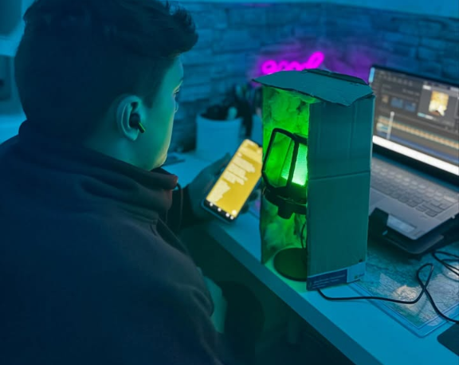
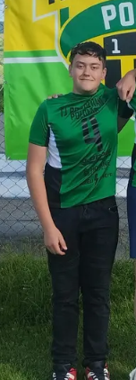
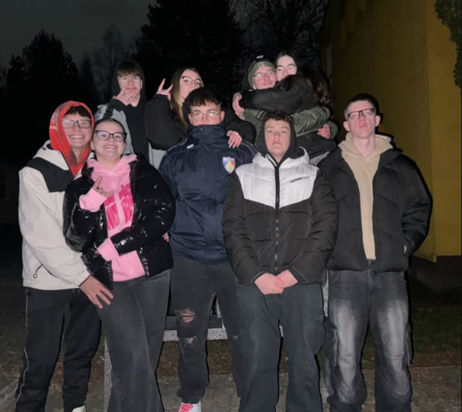
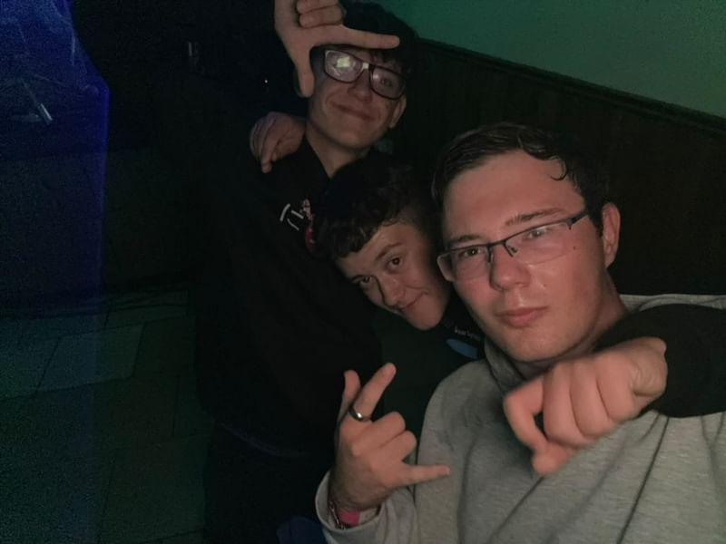
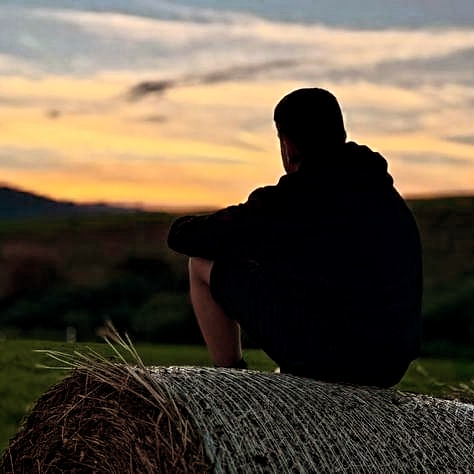
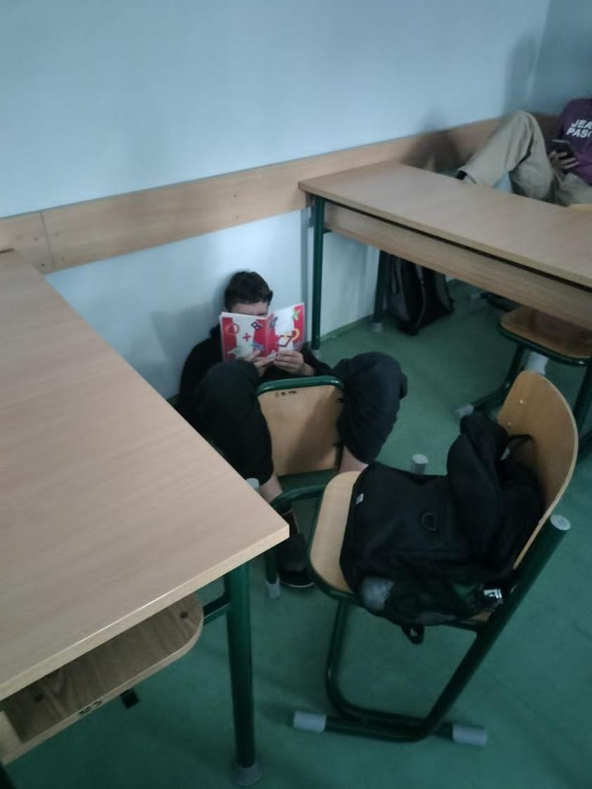
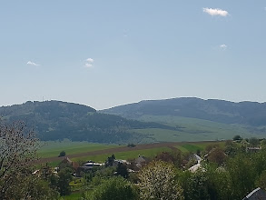

<!DOCTYPE html>
<html lang="en">
<head>
    <meta charset="UTF-8">
    <meta name="viewport" content="width=device-width, initial-scale=1.0">
    <title>Document</title>
    <link href="styly.css" rel="stylesheet" type="text/css"/>
    <link href="https://cdn.jsdelivr.net/npm/bootstrap@5.1.3/dist/css/bootstrap.min.css" rel="stylesheet" integrity="sha384-1BmE4kWBq78iYhFldvKuhfTAU6auU8tT94WrHftjDbrCEXSU1oBoqyl2QvZ6jIW3" crossorigin="anonymous">
</head>
<body>
    

        <header> 
            <h1>Jozef Knut</h1>
        </header>
        
        <nav>
          

            
            <map name="workmap">
              <area shape="rect" coords="0,0,245,252" alt="logo" href="#uvod" class="scroll-link">
            </map>
        
            <ul class="zoznam">
              <li><a href="#omne" class="preklik scroll-link">O mne</a></li>                                           
              <li><a href="#zaujmi" class="preklik scroll-link">Záujmy</a></li>                                          
              <li><a href="#skola" class="preklik scroll-link">Škola</a></li>                                           
              <li><a href="#galeria" class="preklik scroll-link">Galéria</a></li>                                           
              <li><a href="#kontakt" class="preklik scroll-link">Kontakt</a></li>                                          
            </ul>
          

        </nav>
        
        <main class="uvod" id="uvod" class="scrol ">
            <h2 >Úvod</h2>
            

                 Ahoj, volám sa Jozef Knut a toto je moja stránka.
                 Dozviete sa tu niečo o mne, čo rád robím a o škole.
                 Túto stránku som vytvoril vrámci projektu na hodinu Tworba webstránok.

            
           
        </main>
        
        <main class="omne"id="omne" class="scrol ">
            <h2>O mne</h2>
            <ul class="text">
                <li>Volám sa Jozef Knut. Narodil som sa 6.4.2009 v Starej Ľubovni. Mám 16 rokov. 
                <li>Bývam v obci Poloma. Mám dvoch  súrodencov a ja som najmladší. 
                <li>Rád športujem , rád sa smejem a snažím sa byť nápomocný, ak niekto potrebuje moju pomoc.
                <li>Moje obľúbené jedlo sú pirohy a moje obľúbené zviera je pes.
                <li>Mám aj vlastného psa ktorý sa volá Dunčo.
            </ul>
            
Toto som ja:

            
        </main>
        
        <main class="zaujmy"id="zaujmi">
            <h2 >Záujmy</h2>
            <ul class="text">
                <li>Rád hrám futbal. Futbal som začal hrať ako deväťročný.
                <li>Veľmi ma to baví a zatiaľ s tým nechcem prestať.
                <li>Začal som v klube TJ Podhoran Poloma a teraz hrám za dorast v klube FK Šarišské Dravce.
                <li>Mojím obľúbeným futbalovým hráčom je holandský stopér Virgil van Dijk.
            </ul> 
            <ul class="text">
                <li>Mojim ďalším záujmom je tvorba hudby konkrétne rapu. Zatiaľ som vydal 5 skladieb.
                <li>Môj kanál na YouTube sa volá <a href="https://www.youtube.com/@Brosskmusic"alt="odkaz"title="Odkaz na kanál"target="_blank">Brosskmusic.</a>
                <li>V tvorbe mi pomáha môj kamarát Tomáš. Ja píšem texty a on sa stará o vyzuálnu stránku.
                <li>Baví nás to a chceme v tom pokračovať a zlepšovať sa.
            </ul>
            
            
            </main>

        <main class="skola"id="skola">
            <h2 >Škola</h2>
            <ul class="text">
                <li>Chodím na <a href="https://www.spse-po.sk/" title="SPSE-PO"target="_blank">Strednú Priemyselnú Školu Elektorotechniuckú v Prešove.</a>
                <li>Som v triede I.SC . Mám odbor informačné a sieťové technológie.
                <li>Išiel som tu preto lebo ma baví práca s počítačmi. Môj obľúbený predmet je programovanie.
            
Toto je môj aktuálny rozvrh:

            <table ><!--Tabuľka- môj rozvrh hodín-->
                <tr>
                    <th class="tabulka" ></th>
                    <th class="tabulka">1.hodina</th>
                    <th class="tabulka">2.hodina</th>
                    <th class="tabulka">3.hodina</th>
                    <th class="tabulka">4.hodina</th>
                    <th class="tabulka" >5.hodina</th>
                    <th class="tabulka">6.hodina</th>
                    <th class="tabulka">7.hodina</th>
                    <th class="tabulka">8.hodina</th>
                </tr>
                <tr>
                    <td  class="tabulka">Pondelok</th>
                    <td class="tabulka-hodiny">AET</td>
                    <td colspan="2" class="tabulka-hodiny">SIE</td>
                    <td class="tabulka-hodiny">AET</td>
                    <td colspan="2" class="tabulka-hodiny">ZIT</td>
                    <td colspan="2" class="tabulka-hodiny">TWS</td>
                </tr>
                <tr>
                    <td class="tabulka">Utorok</td>
                    <td class="tabulka-hodiny">MAT</td>
                    <td class="tabulka-hodiny">DEJ</td>
                    <td class="tabulka-hodiny">SJL</td>
                    <td class="tabulka-hodiny">CHE</td>
                    <td class="tabulka-hodiny">NBV</td>
                    <td class="tabulka-hodiny"></td>
                    <td class="tabulka-hodiny">AET</td>
                    <td class="tabulka-hodiny"></td>
                </tr>
                <tr>
                    <td class="tabulka">Streda</td>
                    <td class="tabulka-hodiny">ANJ</td>
                    <td class="tabulka-hodiny" colspan="2">ICDL</td>
                    <td class="tabulka-hodiny">MAT</td>
                    <td class="tabulka-hodiny" colspan="2"></td>
                    <td class="tabulka-hodiny">TSV</td>
                    <td class="tabulka-hodiny">ZPXA</td>
                </tr>
                <tr>
                    <td class="tabulka">Štvrtok</td>
                    <td class="tabulka-hodiny" colspan="2">PRO</td>
                    <td class="tabulka-hodiny">ANJ</td>
                    <td class="tabulka-hodiny">MAT</td>
                    <td class="tabulka-hodiny">OBN</td>
                    <td class="tabulka-hodiny" ></td>
                    <td class="tabulka-hodiny">FYZ</td>
                    <td class="tabulka-hodiny" >SJL</td>
                </tr>
                <tr>
                    <td class="tabulka">Piatok</td>
                    <td class="tabulka-hodiny">PRO</td>
                    <td class="tabulka-hodiny">MAT</td>
                    <td class="tabulka-hodiny">SIE</td>
                    <td class="tabulka-hodiny">ANJ</td>
                    <td class="tabulka-hodiny">SJL</td>
                    <td class="tabulka-hodiny">FYZ</td>
                    <td class="tabulka-hodiny" >TSV</td>
                    <td class="tabulka-hodiny"></td>
                </tr>
            </table>

        </main>

        <main class="galeria"id="galeria">
            <h2 >Galéria</h2>
            

                <input type="checkbox" id="zoom4" hidden>
                <label for="zoom4">
                  
                </label>
                

                  <label for="zoom4">
                    
                  </label>
                

              

            
              

                <input type="checkbox" id="zoom5" hidden>
                <label for="zoom5">
                  
                </label>
                

                  <label for="zoom5">
                    
                  </label>
                

              

              

                <input type="checkbox" id="zoom6" hidden>
                <label for="zoom6">
                  
                </label>
                

                  <label for="zoom6">
                    
                  </label>
                

              

              

                <input type="checkbox" id="zoom8" hidden>
                <label for="zoom8">
                  
                </label>
                

                  <label for="zoom8">
                    
                  </label>
                

              

              

                <input type="checkbox" id="zoom9" hidden>
                <label for="zoom9">
                  
                </label>
                

                  <label for="zoom9">
                    
                  </label>
                

              

              

                <input type="checkbox" id="zoom10" hidden>
                <label for="zoom10">
                  
                </label>
                

                  <label for="zoom10">
                    
                  </label>
                

              

        </main>

        <main class="kontakt"id="kontakt">
            <h2 >Kontakt</h2>
            <ul class="text-kontak">
                <li>E-mail:jozefknut20@gmail.com</li>
                <li>Tel.:0951196371</li>
                <li>Adresa: Poloma 187 , 08273</li>
            
            </ul>
            
            <map name="mapa">
              <area shape="rect" coords="0,0,245,252" alt="instagram" href="https://www.instagram.com/jozefknut1/" target="_blank">
            </map>
        </main>
        <main class="kontakt-na"id="kontakt-na">
            <h2 >Kontakujte mňa</h2>
            <form action="submit_form.php" method="POST" class="formular">
                

                  <label for="name">Meno:</label>
                  <input type="text" id="name" name="name" required minlength="5" maxlength="128">
                

                

                  <label for="email">Email:</label>
                  <input type="email" id="email" name="email" required maxlength="256">
                

                

                  <label for="phone">Telefónne číslo:</label>
                  <input type="tel" id="phone" name="phone" minlength="7">
                

                

                  <label for="subject">Predmet:</label>
                  <input type="text" id="subject" name="subject" required minlength="3" maxlength="128">
                

                

                  <label for="message">Text správy:</label>
                  <textarea id="message" name="message" required minlength="5"></textarea>
                

                <button type="submit" class="submit-button">Odoslať</button>
              </form>
        </main>

        <sidebar class="aktuality" id="myBlock" >
            <h2>Aktuality</h2>
            <ul class="text-aktuality">
                <li>Aktuálne nám vo futbale začala sezóna. Sme na druhom mieste tabuľky.Hrajem obrancu a dal som 1 gól.</li>
                

                <li>Pracujem už na novej songe. Vyjde koncom júla</li>
                

                <li>V Polome je všetko normálne. Je tu aktuálne slnečno a teplo.</li>
                

                
Aktúálne fotky zo života:

            </ul> 
            

                

                  

                    
                  

                  

                    
                  

                  

                    
                  

                

                <button class="carousel-control-prev" type="button" data-bs-target="#carouselExampleAutoplaying" data-bs-slide="prev">
                  
                  Previous
                </button>
                <button class="carousel-control-next" type="button" data-bs-target="#carouselExampleAutoplaying" data-bs-slide="next">
                  
                  Next
                </button>
              

        </sidebar>
        <footer class="prava" id="pageFooter">
            
&copy; 2025 Jozef Knut. Všetky práva vyhradené.

        </footer>

        
        
         
          
    

</body>
</html>
